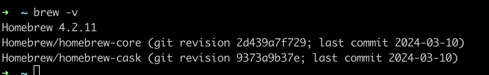
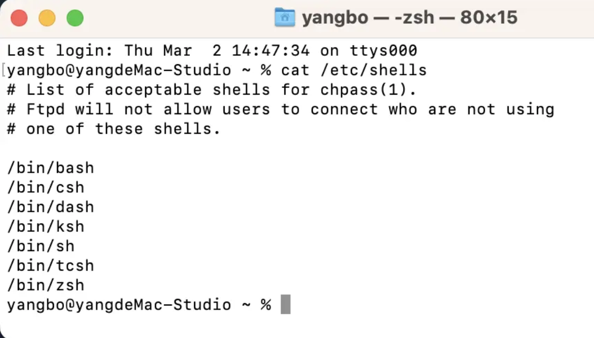
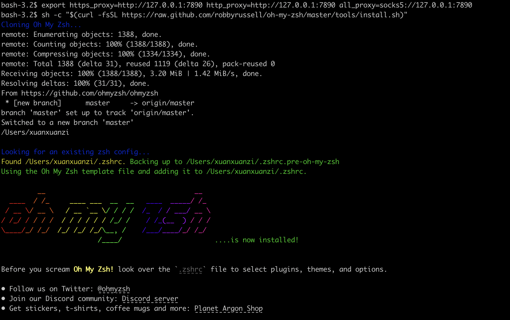

如果你新买了一台 MAC，你一定要看看这篇文章

对于一个小白，只要文档稍微有一点点忽略，可能导致头疼一整天。这篇文章包你安装 Homebrew 和 zsh。

国内用户请记住这几个网站，防止失联。

- https://brew.idayer.com/
- http://javapub.net.cn/


## 安装Homebrew

### 1. 基础安装

以下命令一条条执行

```bash
echo export PATH=/opt/homebrew/bin:$PATH >> ~/.zshrc

source ~/.zshrc

HOMEBREW_CORE_GIT_REMOTE=https://mirrors.ustc.edu.cn/homebrew-core.git

/bin/bash -c "$(curl -fsSL https://cdn.jsdelivr.net/gh/ineo6/homebrew-install/install.sh)"

```

`提示 ： 出现小钥匙符号 输入电脑密码回车即可`

出现 绿色 安装成功 即安装成功


### 2. 切换中科大镜像源

终端执行

```bash
cd "$(brew --repo)"
git clone https://mirrors.ustc.edu.cn/brew.git
 
 
cd "$(brew --repo)/Library/Taps/homebrew"
 
git clone https://mirrors.ustc.edu.cn/homebrew-core.git
 
git clone https://mirrors.ustc.edu.cn/homebrew-cask.git
 
brew update 

```


### 3. 测试是否成功

```bash
cd ~

brew -v
```




## 安装 zsh


查看当前 shell

```bash
echo $SHELL
```

一般 M1 的电脑都默认支持 `zsh`，如果你是其他的 shell 的话，就需要切换一下

查看当前安装了哪些 shell

```bash
cat /etc/shells
```



切换到 zsh

```bash
chsh -s /bin/zsh
```

如果你的电脑没有下载的话，你可以下载 zsh

```bash
brew install zsh
```

下载好之后需要重启一下终端

然后安装 `oh-my-zsh`

```bash
sh -c "$(curl -fsSL https://raw.github.com/robbyrussell/oh-my-zsh/master/tools/install.sh)"
```

```bash
如果报错：

curl: (7) Failed to connect to raw.githubusercontent.com port 443 after 22 ms: Couldn't connect to server

请配置代理：

export https_proxy=http://127.0.0.1:7890 http_proxy=http://127.0.0.1:7890 all_proxy=socks5://127.0.0.1:7890
```



出现这个界面，表示安装成功啦

