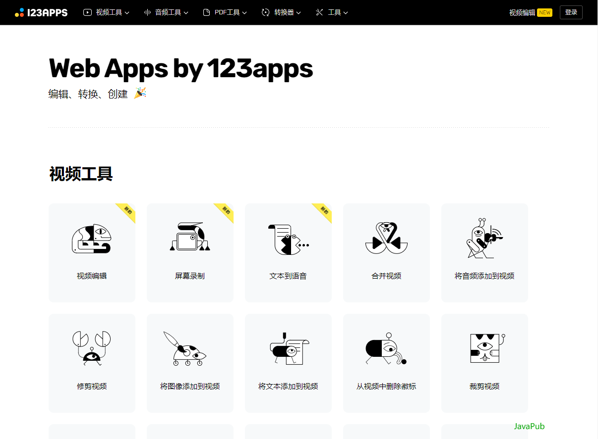
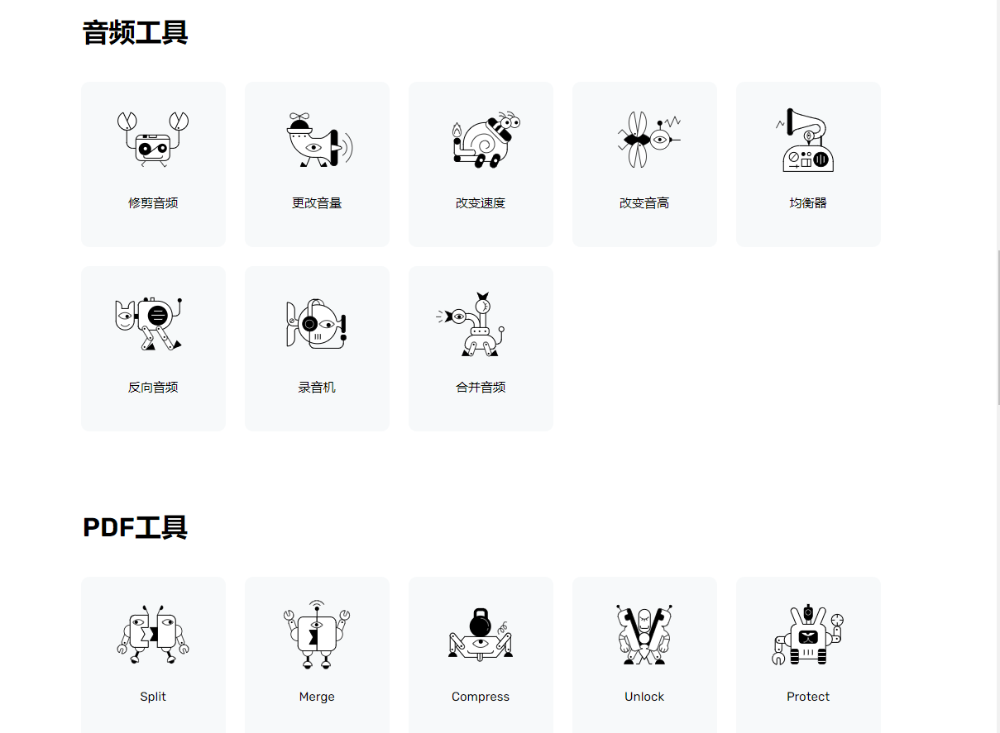
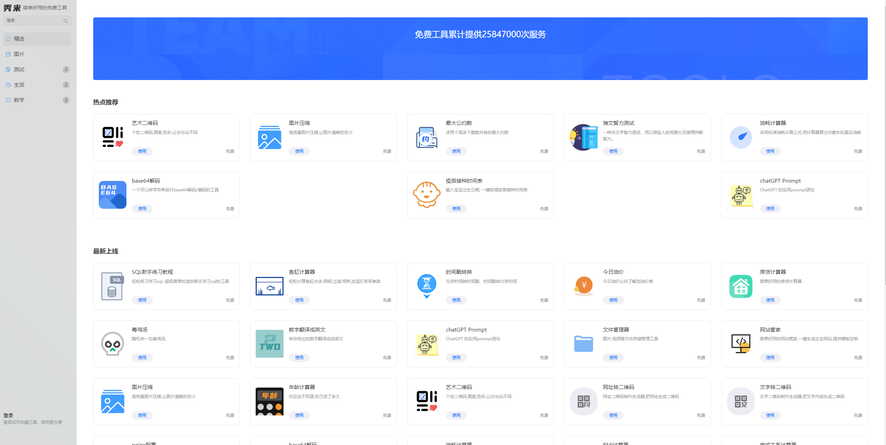
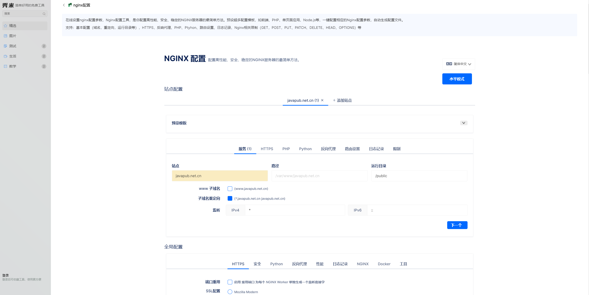

<!--
 * @Author: JavaPub
 * @Date: 2024-02-27 23:14:33
 * @LastEditors: your name
 * @LastEditTime: 2024-02-29 20:59:51
 * @Description: Here is the JavaPub code base. Search JavaPub on the whole web.
 * @FilePath: \JavaPub-Blog\docs\posts\tools\好物期刊#1：在线工具.md

 https://github.com/bestxtools/awesome-toolbox-chinese
-->

我每天都在用的在线工具

https://javapub.net.cn

> 王哥的好物期刊，记录日常看到有价值的信息，主要覆盖计算机领域，定期发布。

## 123apps

它是一款在线应用，它可以让您直接在浏览器中剪辑音轨。有音频切割机、音频细木工、音频转换器、视频转化器、录像机、录音机、档案提取器、PDF工具等九大部分功能，基本满足了你的日常音频视频处理的需求了。

在视频编辑器，丢一个视频进去，就可以直接编辑和导出了，至于视频的格式？这个在线编辑器就一个字，狂！123apps 在常见问题解答里面是这么说的：

这个编辑的文件不会添加平台水印，另外前排说一下，在免费的选项上面，123apps并不是完全免费，它有自己的收费项目，但是跟其他的在线工具来说，这个还是比较良心的，首先它不需要登录，也不限制使用时的功能，而是对每天的文件数量与最大文件大小作出限制。

- https://123apps.com/

## 秀米

秀米是一个汇集了多个常见小工具的在线平台，它可以让用户在网页上使用这些小工具。比如我常用的图片压缩、 ChatGPT Prompt、base64解码、SQL 练习、时间戳等等。

有些同学不擅长使用 nginx，而秀米提供了一个在线编写 nginx 的功能，通过选择 nginx 不同的功能和模块就可以直接编写 nginx 配置文件了。

