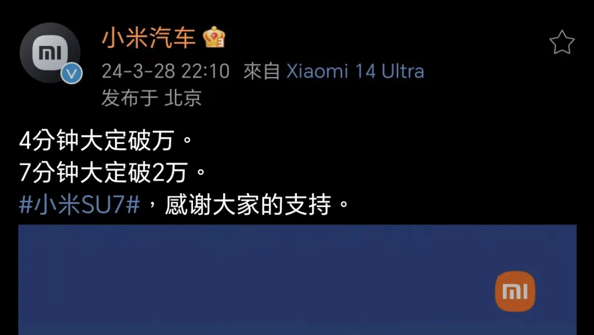
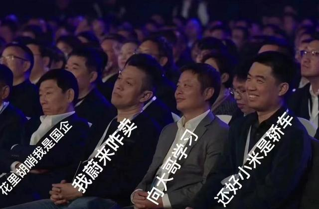
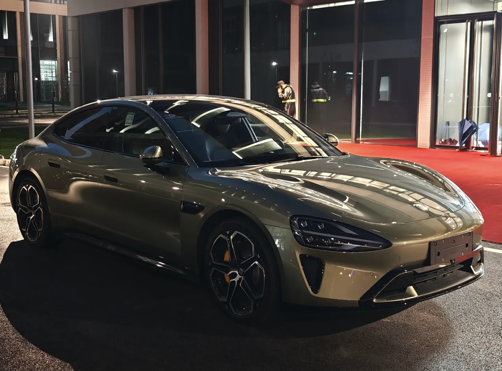
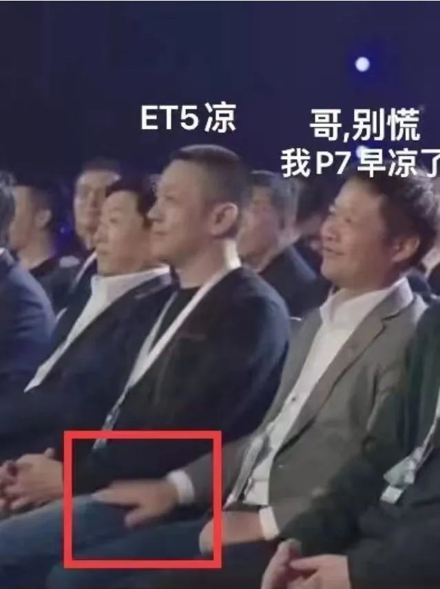

<!--
 * @Author: JavaPub
 * @Date: 2024-03-29 22:13:39
 * @LastEditors: your name
 * @LastEditTime: 2024-03-29 22:38:47
 * @Description: Here is the JavaPub code base. Search JavaPub on the whole web.
 * @FilePath: /JavaPub-Blog/docs/posts/面试与职场/21.59万.md
-->

今天最热闹的事就是小米 SU7。

小米作为造车后起者，这次发布会的影响力绝对碾压造车新势力-蔚小理。网上评论也是各有不一，毕竟每个人对小米的期望不同、对车的定位也不同。

雷总作为国内最会营销的企业家之一，发布会整体很不错，价格也到了绝大多少电车购买者的心坎里，听说第一波定金就达到 1 亿（每辆定金5k），当然米粉应该是第一波非常大的客户群体。如果有能力买辆备用车，一定会选一辆。

下面看看网友的看法。

用户 `现实主义***`

刚看完发布会，我先说结论吧：小米su7产品定义我认为存在较为明显的瑕疵，我甚至认为小米第一次在战略级爆款上没有做到“参数碾压”；考虑到小米品牌的号召力和雷总的人脉加持，我认为小米su7头几万销量肯定会卖的很快，但后续稳态可能较为乏力；小米汽车的胜负手，恐怕要等到下半年的SUV。

用户 `sens`

删除了对其他车企的评价，因为这一刻我觉得su7就是su7，喜欢他的就会喜欢，不喜欢的就散了吧！对线、质疑没啥意义。这就是我想要的车，大家爱买啥买啥就行了

除了车本身，我还是坚持认为，小米集团最核心的技术就是雷军，没有雷军我感觉小米啥也不是。雷军天才中的天才，勤奋中的勤奋。手握大笔现金，时代风口，政策扶持，民心所向如果他都不能成功那天道勤酬一定是假的，是忽悠人的。永远相信美好的事情发生是对自己的一种期望，大家不愿意看到雷军这样的人输仅此而已。

也有用户在今天就参与了试驾。

更新试驾体验

1.小爱可以控车，站车外也行，比如喊他开个前后备箱，特斯拉和siri也行，但要拿iphone 他这个不需要
2.后排我是觉得绰绰有余，比我阿特兹大一点，我不是很在意后排 够用就行
3.后排有半导体冷暖箱 4~6瓶矿泉水容量
4.电门线性，有单踏板强回收模式 高电量回收力度不受影响 动能回收0~100可调
5.模拟声浪
6.手机丢车内充电槽忘拿车会提醒
7.车很灵活，不感觉像5m的车
8.b柱有扭钉挂钩估计是挂东西的
9.试驾电耗不高15~16
10.坐姿可以调很低，座椅有主动包裹，变道激发
11.hud很清晰 但我不习惯，有点挡视线
12.前排感觉不是很吵 可能是风阻小的原因
13.低配cltc续航从668提升到了700

最后

今天在网上很火的照片

 
