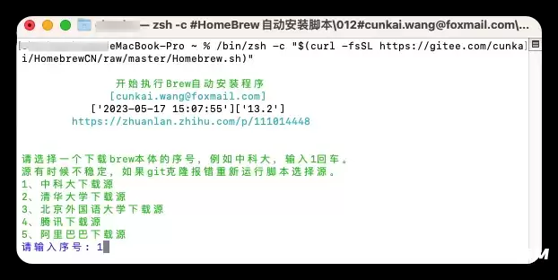
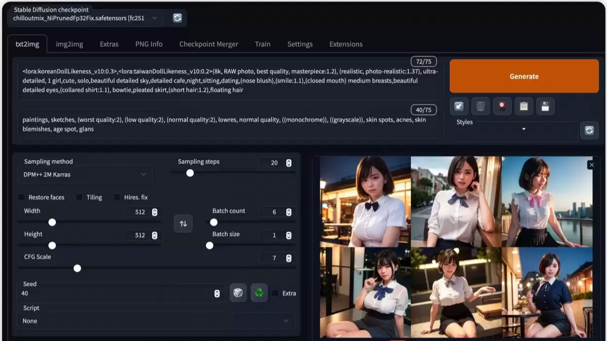

<!--
 * @Author: JavaPub
 * @Date: 2023-07-22 22:11:34
 * @LastEditors: your name
 * @LastEditTime: 2023-07-22 22:16:39
 * @Description: Here is the JavaPub code base. Search JavaPub on the whole web.
 * @FilePath: \JavaPub-Blog\docs\willbe\AI\Stable-Diffution\安装\MAC.md
-->

> 如果中间遇到问题，可以来  JavaPub 找我。

# 安装AI绘画软件Stable-Diffution-Webui教程及问题集锦（Mac苹果电脑）

### 一．前言

Ai绘图，目前开源免费且最好用的本地运行工具之一是 stable-diffusion-webui 工具。

### 系统要求：

老款 MAC 也可以使用，新款最好是 M1 PRO 和 M2，内存越大越好（越大越快）

硬盘可用空间最低 10G 以上，最好 30G 以上

需要能够流畅访问内外网

### 手动安装开始：

**手动安装适合有一定软件基础的同学，并且手动版也比较稳定。**

1.打开终端输入命令：Homebrew 安装命令：

```bash
/bin/zsh -c "$(curl -fsSL https://gitee.com/cunkai/HomebrewCN/raw/master/Homebrew.sh)"
```

homebrew 卸载命令，不想用了在卸载！：

```bash
/bin/zsh -c "$(curl -fsSL https://gitee.com/cunkai/HomebrewCN/raw/master/HomebrewUninstall.sh)"
```

2.随便选择一个源，然后按照流程按照后重启。



3.安装python

```bash
brew install cmake protobuf rust python@3.10 git wget
```

4.安装stable-diffusion-webui


如果未安装git的，先安装git。

```bash
brew install git
```

接着用git 把 stable diffusion webui 的 github 开源程序全部克隆到自己的 mac 电脑本地，控制台内执行：

```bash
git clone https://github.com/AUTOMATIC1111/stable-diffusion-webui
```

5.安装完成后使用cd命令切换到文件目录，然后运行

```bash
./webui.sh
```

这一步可能需要花费较长时间，因为会下载几个sd必需的应用，比如gfpgan等（如卡住可以参考下面常见问题）

6.打开stable-diffusion-webui网页版

注意不要关闭控制台小窗，打开浏览器(safari或者chrome)后输入

http://127.0.0.1:7860，即可访问本地网页版的stable diffusion webui



